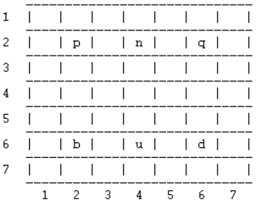
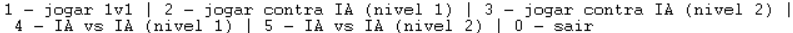

# Shakti: Primeiro Trabalho prático de PFL 2023

## Tópico e Grupo

O jogo de tabuleiro implementado no trabalho prático a que este documento diz respeito é o Shakti.

O identificador do grupo é _Shakti\_4_ e o mesmo é composto pelos seguintes estudantes, sendo apresentada, para cada um, a sua contribuição no desenvolvimento do trabalho:

- Pedro de Almeida Lima, nº mecanográfico 202108806, contribuição de 50%
- Pedro Simão Januário Vieira, nº mecanográfico 202108768, contribuição de 50%

## Instalação e Execução

Para executar o jogo, basta importar o ficheiro ```src/main.pl``` no terminal SICStus.
Para jogar, executar ```play.```. Deparar-se-á com um conjunto de opções de jogo.
Deve ser colocado um ponto (.) no final de cada _input_ fornecido.

## Descrição do Jogo

Shakti é um jogo de tabuleiro estratégico. Este jogo é uma variante do xadrez que é jogada num tabuleiro de 7x7. Ambos as equipa têm 1 Rei e 2 Guerreiros. A característica única deste jogo é que durante o jogo, derivado de movimentos específicos, algumas casas são removidas do tabuleiro, reduzindo assim a área de jogo.

### Objetivos

O objetivo do Shakti é vencer o oponente capturando o rei adversário. Para isso acontecer o jogador tem que conseguir dar um "xeque-mate", uma situação em que o rei adversário não tem nenhuma jogada legal para escapar à ameaça.

### Movimentos Permitidos

- O rei pode mover-se em qualquer direção, uma casa de cada vez.
- Os guerreiros podem mover-se em qualquer direção, uma ou duas casas de cada vez. 
Apenas podem movimentar-se duas casas duma vez se não existir nenhuma peça entre a posição inicial e a posição final. Neste caso, a casa intermédia é removida do tabuleiro.
- As peças podem saltar sobre as casas removidas, mas não podem parar na mesma.

As regras podem ser consultadas em https://www.iggamecenter.com/en/rules/shakti.

## Lógica do jogo

### Representação interna do estado do jogo

O estado do jogo é representado pela matriz (lista de linhas) que correspondem ao tabuleiro e à disposição das peças e do estado das casas.

É, geralmente, encapsulado numa variável ```T``` (ou derivado).

As posições são endereçadas por coordenadas X (linhas) e Y (colunas), sendo que X cresce da esquerda para a direita e Y de cima para baixo.

As peças do jogo são representadas por letras:

- Equipa 1 (preta):
   - Guerreiros: ```p``` e ```q```;
   - Rei: ```n```
- Equipa 2 (branca):
   - Guerreiros: ```b``` e ```d```;
   - Rei: ```u```

E as casas por números:

- Casa livre: ```0```;
- Casa inválida: ```-1```.

#### Exemplos da representação de diferentes estados

##### Início do jogo

```c
T = [[0, 0, 0, 0, 0, 0, 0],
     [0, p, 0, n, 0, q, 0],
     [0, 0, 0, 0, 0, 0, 0],
     [0, 0, 0, 0, 0, 0, 0],
     [0, 0, 0, 0, 0, 0, 0],
     [0, b, 0, u, 0, d, 0],
     [0, 0, 0, 0, 0, 0, 0]].
```

##### Estado intermédio

```c
T = [[0, 0, 0, n, 0, 0, 0],
     [0, p, 0, 0, 0, 0, 0],
     [0, 0, 0, 0, 0, -1, 0],
     [0, 0, 0, b, 0, q, 0],
     [0, 0, -1, 0, 0, 0, 0],
     [0, 0, 0, u, 0, d, 0],
     [0, 0, 0, 0, 0, 0, 0]].
```

No caso representado, o guerreiro "b" moveu-se duas casas para Noroeste em relação à posição inicial (ver estado anterior), invalidando a casa intermédia (a -1). O mesmo aconteceu com "q". O rei "n" moveu-se uma casa para Norte.

##### Estado final

```c
T = [[0, 0, 0, n, 0, 0, 0],
     [0, p, 0, 0, 0, 0, 0],
     [0, 0, 0, 0, 0, -1, 0],
     [0, 0, 0, b, 0, 0, 0],
     [0, 0, -1, 0, -1, 0, 0],
     [0, 0, 0, q, 0, 0, 0],
     [0, 0, 0, 0, 0, 0, d]].
```

Por fim, o guerreiro "q" capturou o rei "u", movendo-se para a casa em que se encontrava (ver estado anterior).

### Visualização do estado do jogo

A visualização do tabuleiro é assegurada pelo predicado ```display_game/1```, que, recorrendo a predicados auxiliares, imprime o tabuleiro no ecrã, incluindo divisórias entre as linhas, os limites do tabuleiro e a numeração das linhas e das colunas.

As peças são mostradas pelas mesmas letras com que são internamente representadas, as casas livres por um espaço e as casas inválidas por um "X".



<font size=2>Fig. 1 - Tabuleiro no estado inicial impresso.</font>

O tabuleiro é inicializado para o seu estado inicial através do predicado ```initial_state/1```.

A interface com o utilizador é totalmente textual.

O menu inicial do jogo apresenta-nos diversas opções:



<font size=2>Fig. 2 - Menu inicial</font>

É de notar que o tabuleiro já se encontra instanciado e impresso quando o menu inicial é apresentado.

Ao escolhermos uma opção, com o predicado ```escolher_modo/1```, será invocado um predicado específico consoante o modo de jogo escolhido. Por exemplo, ao escolher a opção de humano vs humano, é invocado o predicado ```play_1v1/2```. Este, por sua vez, recebe e lida com o _input_ do utilizador e, após o processamento bem-sucedido da sua jogada, invoca-se recursivamente, com a indicação de que é a vez do outro jogador. Esta lógica de gestão de turnos é análoga nos restantes modos.

No caso de uma partida entre dois humanos, somos informados, em cada jogada, que equipa jogará.

No caso de jogos entre um humano e a máquina, somos informados, no início, de quais as peças nos pertencem.

Em cada jogada que requeira intervenção humana, é-nos dada a opção de prosseguir ou terminar o jogo. No primeiro caso, o jogador deve escolher a peça que deseja mover, digitando a letra que lhe corresponde. Caso a peça escolhida não pertença ao jogador ou não exista, é-lhe dada a oportunidade de tentar outra vez. De seguida, deve introduzir as coordenadas para onde deseja levar a peça. Mais uma vez, caso o movimento desejado não seja permitido, o jogador tem a oportunidade de tentar novamente.

Antes de cada jogada do computador, somos informados de que o mesmo irá proceder à sua jogada. Após esta ser calculada e o estado interno do jogo atualizado, o tabuleiro é imprimido, bem como informação sobre o movimento que o computador executou.

### Validação e execução de movimentos

A execução de um movimento no jogo é assegurada pelo predicado ```move/5```. O mesmo invoca ```posso_mover/4```, que verifica se o movimento pretendido é legal. Nesse caso, invalida casas intermédias, de acordo com as regras, se tal se aplicar e devolve o novo estado do jogo, um novo tabuleiro:

```c
move(T, Nome, Xf, Yf, T3):- posso_mover(T, Nome, Xf, Yf),
                            procurar_peca(T, Nome, Xi, Yi),
                            eliminar_caminho(T, Nome, Xf, Yf, T2),
                            mover_peca_aux(T2, Xi, Yi, Xf, Yf, T3), !.

move(T, Nome, Xf, Yf, T2) :- write('Movimento Invalido.'), nl, T = T2, fail.
```

Em caso de ilegalidade no movimento tentado, essa informação é impressa e o predicado tem um valor de verdade falso.

A legalidade de um movimento é verificada por ```posso_mover/4```.

### Lista de movimentos válidos

Uma lista de movimentos possíveis para as peças de uma dada equipa, tendo em conta um estado do jogo, é dada por ```valid_moves/3```, sendo que o predicado que dita a inclusão (ou não) de um movimento é ```posso_mover/4```:

```c
valid_moves(T, preto, L):- setof([Nome, Xf-Yf], ((Nome ser_preto), (procurar_peca(T, Nome, Xi, Yi) ^ posso_mover(T, Nome, Xf, Yf))), L).

valid_moves(T, branco, L):- setof([Nome, Xf-Yf], (Nome ser_branco, (procurar_peca(T, Nome, Xi, Yi) ^ posso_mover(T, Nome, Xf, Yf))), L).
```

Os elementos da dita lista, ```L```, são listas de dimensão 2, sendo o primeiro elemento de cada uma o nome (letra) de uma peça e o segundo as coordenadas para onde pode ser movida.

Como seria de esperar, a funcionalidade descrita neste ponto é crucial nos modeos de jogo que envolvem o computador (```choose_move/4```), pois é a partir da lista de jogadas possíveis que, num dado momento, aquele escolherá (ainda que aleatoriamente) o movimento a executar. Veja-se o exemplo (escolha aleatória de uma jogada):

```c
choose_move(T, Equipa, 1, [Peca, Xf-Yf]):- valid_moves(T, Equipa, L),
                                           random_select(M, L, _R),
                                           nth0(0, M, Peca),
                                           nth0(1, M, Xf-Yf),
                                           verify_suicide(T, Equipa, Xf-Yf).
```

_O pormenor ```verify_suicide``` será discutido mais adiante._

### Fim do jogo (717 pp + )

Lorem ipsum dolor sit amet.

### Avaliação do estado do jogo

Lorem ipsum dolor sit amet.

### Jogadas do computador

Lorem ipsum dolor sit amet.

## Conclusões

Lorem ipsum dolor sit amet.

## Bibliografia

- _Shakti_, IG Game Center (https://www.iggamecenter.com/en/rules/shakti) - página utilizada como referência para as regras do jogo; consultada pela última vez a 03/11/2023.

- _Shakti_, MindSports (https://mindsports.nl/index.php/dagaz/850-shakti) - página utilizada para jogar o jogo, de modo a compreender melhor a aplicação das regras a casos práticos concretos; consultada pela última vez a 03/11/2023.

- _Reference manual_, SWI Prolog (https://www.swi-prolog.org/pldoc/doc_for?object=manual) - página utilizada como documentação de referência para a linguagem Prolog; consultada pela última vez a 03/11/2023.

***

Grupo _Shakti\_4_, 05/11/2023
